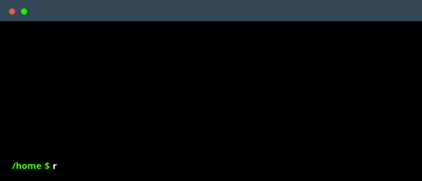

# Replay:  save and replay sequences of shell commands

Replay is a lightweight CLI tool to record, stash-like save, and replay shell command sessions.
It’s ideal for automation, reproducibility, and quick demonstrations.

<p align="center">
  
</p>

## Installation

```sh
cargo install replay_pty
```

## Usage
💡 Run `replay help` to see all available commands.

### Record a Session
```sh
replay record
```
Use `replay record -h` to see all the options available for this command.

Recording a session automatically saves it in a **stash-like index** with identifiers such as `replay@{0}`, similar to how git stash works.

### Replay a Session
To run a recorded session of commands :
```sh
replay run  # runs the last recorded session (replay@{0})
```
You can also run a specific saved session by index:
```sh
replay run replay@{2}
```
Use `replay run -h` to see all the options available for this command
## License
Replay is licenced under MIT license ([LICENSE-MIT](./LICENSE-MIT) or http://opensource.org/licenses/MIT)


## Contributing

Contributions are very welcome!
Please see our [contributing guide](./CONTRIBUTING.md) for details.

Thanks to all the people who already contributed!

<a href="https://github.com/baptleduc/replay/graphs/contributors">
  
</a>
